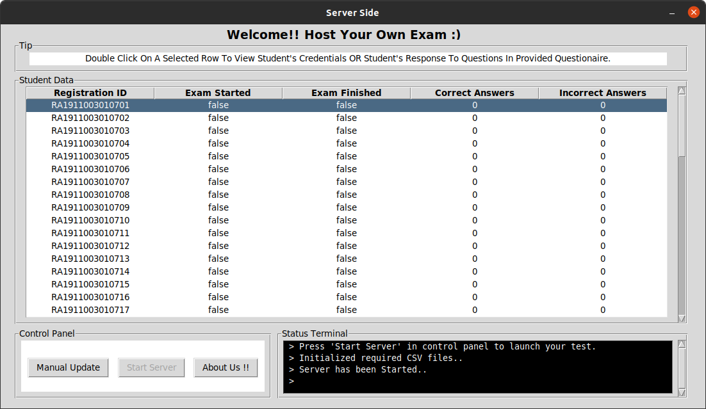
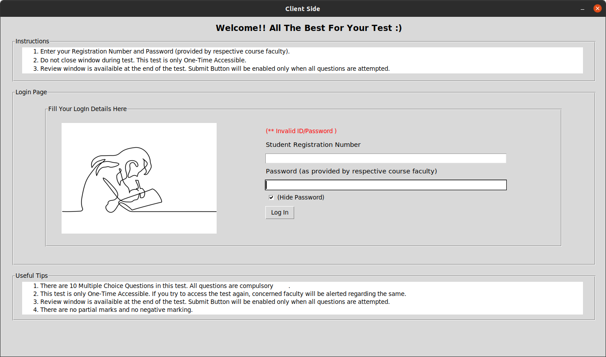

# Lan Based Examination Using Socket Programming


Client And Server communication GUI Application using tkinter and socket programming in python 3.

## Table of contents
* [Introduction](#introduction)
* [Technologies](#technologies)
* [Setup](#setup)
* [Launch](#launch)
* [Illustrations](#illustrations)
* [Contribution](#contribution)
* [Status](#status)
* [Sources](#sources)
* [Other](#other)


## Introduction
**Socket programming** is a way of connecting two nodes on a network to communicate with each other. One socket(node) listens on a particular port at an IP, while the other socket reaches out to the other to form a connection. The **SERVER** forms the listener socket while the **CLIENT** reaches out to the server. 

This Project helps to establish a new way of exam monitoring system in which multiple **candidates (acting as clients)** are only connected to a single **examiner (acting as server)** with a GUI interface in between.

Best things about this project are :-
* Easy to setup
* Interactive GUI
* No need for Internet Access
* Less chance of copying from Internet

Structure / Working Of Our Project :-
<p align="left">
  
</p>

 
## Technologies
  #### Software Used :
  * VS Code : 1.62.3
  #### Languages Used :
  * Python 3.8


## Setup
- Python3 should be installed
- Clone this repository
- File strucure should be like following
```
.
├── Extra
├── main
│   ├── client.py
│   ├── CSV_Files
│   │   ├── id_passwords.csv
│   │   ├── progress.csv
│   │   ├── questionaire.csv
│   │   └── tmp.py
│   ├── images
│   │   ├── login_img2.jpg
│   │   ├── login_img.jpg
│   │   └── profile.jpeg
│   ├── server.py
│   └── watchdog
└── README.md
```
- Set up questionaire according to provided format
- Set up IDs and Passwords according to provided format

## Launch
- Open main folder in cloned repository folder
- Open terminal in the same folder
- Run command ```python3 server.py``` for server side implementation
- Run command ```python3 client.py``` for client side implementation

## Illustrations
## Before Submission
### Inactive Server Side
<p align="left">
  
</p>

### Active Server Side
<p align="left">
  
</p>

### Student Credential Window
<p align="left">
  
</p>

### Student Response Window
<p align="left">
  
</p>

### Questionaire Window
<p align="left">
  
</p>

### Client Side Log In Window
<p align="left">
  
</p>

### Only Allowed Credentials
<p align="left">
  
</p>

### Questions With Multiple Choices
<p align="left">
  
</p>

### Review Tab
<p align="left">
  
</p>

## After Submission
### Server Side
<p align="left">
  
</p>

### Student Response Window
<p align="left">
  
</p>

## Only One Time Access
<p align="left">
  
</p>

## Contributiors
<div width=10% height=10%>
	 
	
</div>


## Project status
Completed!!


## Sources
* [Python 3 Documentation](https://www.python.org/)
* [Socket Programming In Python](https://realpython.com/python-sockets/)
* [Tkinter Documentation](https://docs.python.org/3/library/tkinter.html)  
* [Multithreading](https://www.geeksforgeeks.org/multithreading-python-set-1/)
* Images used in this project may be subject to copyright.


## Other
This Project was created under course "Computer Networks" under the guidance of Dr.K.Sreekumar, course provided by SRM Institute of Science and Technology, SRM Nagar, Kattankulathur, Chengalpattu District, Tamil Nadu - 603 203 , India.